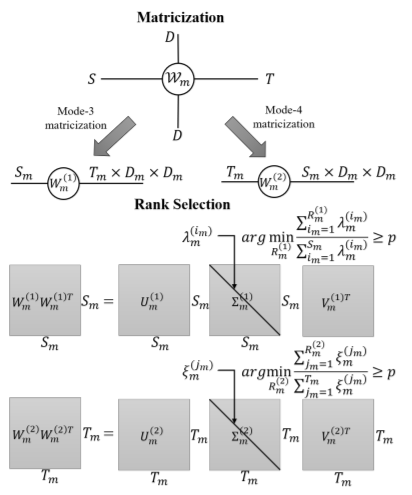
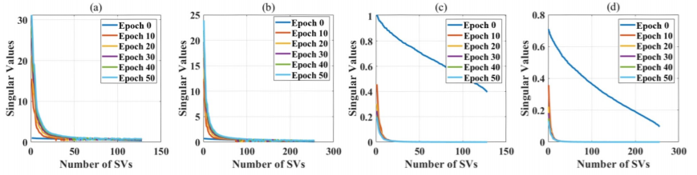
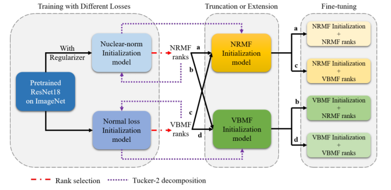

# Explotiting Elasticity in Tensor Ranks for Compressing Neural Networks ([Link](https://arxiv.org/pdf/2105.04218.pdf))

## Nuclear-norm Rank Minimization Factorization (NRMF)


## Contributions
+ We exploit the elasticity in tensor ranks during training by adding a nuclear-norm-like regularizer to the loss function, in contrast to everything being hardwired at the beginning as in the VBMF approach.
+ By analyzing variation of ranks in early CONV layers to deeper ones, one observes an interesting decreasing of ranks in the last several layers. This could be guidance to remove redundancy in wide layers without much information loss.
+ The proposed NRMF is generic, dynamic rank selection method wchich can be applied for low-rank CNN approximation together with other techniques such as quantization and pruning.

## Citation
If you use NRMF in your research, please kindly cite this work by
```
Ran, J., Lin, R., So, H. K., Chesi, G., & Wong, N. (2021, January). Exploiting Elasticity in Tensor Ranks for Compressing Neural Networks. In 2020 25th International Conference on Pattern Recognition (ICPR) (pp. 9866-9873). IEEE.
```

## Running Codes
Will be avaliable soon.

## Experimental Results

### Effect of Regularizer on SVs of the Parameters
We use a simple example to illustrate the effect of the
nuclear-norm regularizer. Specifically, we apply NRMF to
a modified LeNet5 on MNIST, namely, by inserting
an extra CONV layer with a kernel tensor of size W ∈
R^{3×3×128×256} into the original network, then training with
and without the regularizer. In the test, we set the scaling
coefficient α = 10−2, use a batch size of 64 and learning rate
10−4 decaying 0.1 times every 5 epochs. We train the modified
LeNet5 for 50 epochs to show the trend of SV variation. **It is observed that during training, the reularizer concentrates the importatnt information flow into low-rank matrices, whicj facilitates subsequent model compression.**



### VBMF vs. NRMF
**Firstly**, we use the pretrained model on ImageNet to train on CIFAR-10 with and without nuclear-norm-like-regularizer. Iext, by applying VBMF and NRMF to obtained normal and nuclear-norm initialization models separately, we can get VBMF and NRMF ranks. **After this**, we use the ranks to do the Tucker-2 decomposition as shown by the dotted arrows. Therefore, we collect VBMF and NRMF initialization models. **Next**, we use each of the two sets of the ranks on the VBMF and NRMF initialization models, such that a total of four rank-initialization and combinations are obtained for the fine-tuning phase.



Threshold effects for ResNet18 on CIFAR_10 with p=92%.

| | VBMF ranks | NRMF ranks |
|:---:|:---:|:----:|
| VBMF initialization | 94.40% | 93.50% |
| NRMF initialization | 95.46% | 94.21% |
| #Parameters | 7.01M | 3.05M |

Threshold effects for ResNet18 on CIFAR-10 with p=95%.

| | VBMF ranks | NRMF ranks |
|:---:|:---:|:----:|
| VBMF initialization | 94.40% | 94.40% |
| NRMF initialization | 93.58% | 93,91% |
| #Parameters | 7.01M | 3.88M |

Threshold effects for ResNet18 on CIFAR-10 with p=98%.

| | VBMF ranks | NRMF ranks|
|:----:|:----:|:----:|
| VBMF initialization | 94.40% | 95.07% |
| NRMF initialization | 92.98% | 93.58% |
| #Parameters | 7.01M | 5.28M |

### Layer-wise Analysis of Compression Ratios
Layer-wise analysis on ResNet18. S: Input channel dimension.
T: Output channel dimentsion. R3 and R4 are Tucker-2 ranks. p = 95% to select ranks.

| Layer | S/R3 | T/R4 | #Parameters |
|:---:|:---:|:---:|:---:|
| conv1 | 256 | 256 | 589.82K |
| conv1 (VBMF) | 168 | 176 | 354.18K(x1.67) |
| conv1 (NRMF) | 144 | 141 | 255.70K(x2.31) |
| | | | |
| conv2 | 256 | 512 | 1.18M |
| conv2 (VBMF) | 194 | 275 | 670.61K(x1.76) |
| conv2 (NRMF) | 222 | 299 | 807.32K(x1.46) |
| | | | |
| conv3 | 512 | 512 | 2.36M |
| conv3 (VBMF) | 332 | 328 | 1.32M(x1.79) |
| conv3 (NRMF) | 292 | 212 | 851.18K(x2.89) |
| | | | |
| conv4 | 512 | 512 | 2.36M |
| conv4 (VBMF) | 348 | 342 | 1.42M(x1.66) |
| conv4 (NRMF) | 160 | 69 | 216.61K(x10.89) |
| | | | |
| conv5 | 512 | 512 | 2.36M |
| conv5 (VBMF) | 382 | 392 | 1.74M(x1.35) |
| conv5 (NRMF) | 31 | 39 | 46.72(x50.50) |

### Performances on Various Datasets and Neural Networks

#### CIFAR-10
| Model | Rank Selection | Top-1 Accuracy (%) | #Parameters |
|:---:|:---:|:---:|:---:|
| | Baseline | 91.85 | 57.04M |
| AlexNet  | VBMF | 91.92 | 55.93M |
| | NRMF | 93.03 | 55.05M |
| | | | |
| | Baseline | 95.53 | 5.61M |
| GoogLeNet  | VBMF | 96.18 | 4.20M |
| | NRMF | 95.57 | 4.08M |
| | | | |
| | Baseline | 96.56 | 6.96M |
| DenseNet | VBMF | 95.29 | 5.85M |
| | NRMF | 96.99 | 5.85M |

#### CIFAR-100
| Model | Rank Selection | Top-1 Accuracy (%) | Top-5 Accuracy (%) | #Parameters |
|:---:|:---:|:---:|:---:|:---:|
| | Baseline | 71.12 | 91.75 | 57.41M |
| AlexNet | VBMF | 69.73 | 90.51 | 56.32M |
| | NRMF | 68.97 | 90.06 | 55.45M |
| | | | |
| | Baseline | 78.96 | 95.56 | 5.70M |
| GoogLeNet | VBMF | 79.50 | 95.88 | 4.27M |
| | NRMF | 78.93 | 95.25 | 4.14M |
| | | | |
| | Baseline | 81.43 | 96.30 | 7.06M |
| DenseNet | VBMF | 82.98 | 96.13 | 5.92M |
| | NRMF | 83.53 | 96.70 | 5.90M |

#### ImageNet
| Model | Rank Selection | Top-1 Accuracy (%) | Top-5 Accuracy (%) | #Parameters |
|:---:|:---:|:---:|:---:|:---:|
| | Base | 69.76 | 89.08 | 11.69M |
| ResNet18| VBMF | 67.20 | 87.88 | 7.50M |
| | NRMF | 67.27 | 87.70 | 6.81M |

## License
NRMF is released under MIT License.